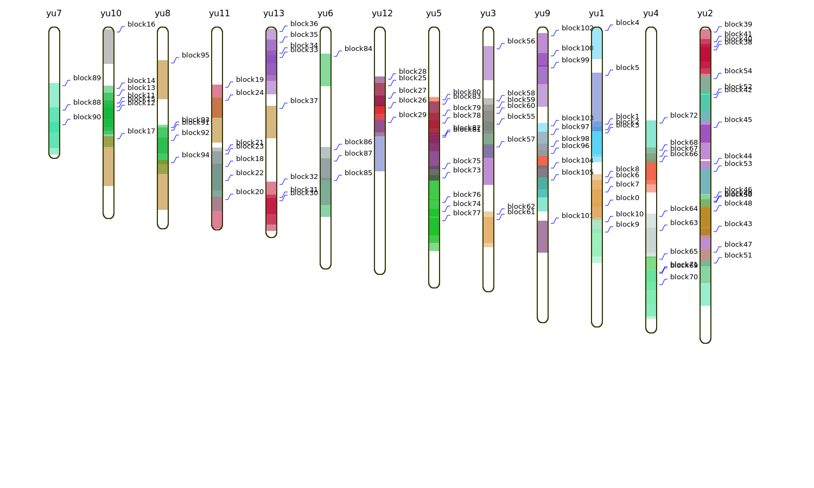

# chrVis
Visualize genes or LinkageMap on chromesomes

## Requirements

The script requires python module : svgwrite

install with pip:

```
pip install svgwrite`
```

or from source:

```
python setup.py install
```

## sample command line

`python main.py sample_chr.txt sample_gene.txt -o sample_output.svg -wi 400px -hi 600px`

## Usage


```
usage: main.py [-h] [-o OUTPUT] [-wi WIDTH] [-hi HEIGHT] [-f FONTSIZE]
               chr gene

positional arguments:
  chr                   chr file
  gene                  gene file

optional arguments:
  -h, --help            show this help message and exit
  -o OUTPUT, --output OUTPUT
                        output filename
  -wi WIDTH, --width WIDTH
                        width of the image
  -hi HEIGHT, --height HEIGHT
                        height of the image
  -f FONTSIZE, --fontsize FONTSIZE
                        font size

```

## sample chr file

Three columns `chromesome name` , `chromosome length`, `chromosome color`


```
chr1    2000000 #333300
chr2    1400012 #333300
chr3    1900000 #333300
```


## sample gene file

Five columns `chromesome name` , `gene name`,`gene position`,`size`, `color`

```
yu1	block0	18655440	349111	#bacac6
yu4	block63	21300577	380675	#bacac6
yu4	block64	19835040	1299089	#bacac6
yu4	block65	24342697	743709	#00bc12
yu5	block73	15698017	1530347	#00bc12
yu5	block74	19286756	774087	#00bc12
yu5	block75	14726663	789333	#00bc12
yu5	block76	18302344	937674	#00bc12
yu5	block77	20273832	661715	#00bc12
yu10	block11	7776987	391879	#0eb83a
yu10	block12	8618148	1295415	#0eb83a
yu10	block13	6995751	761896	#0eb83a
```

## sample output


